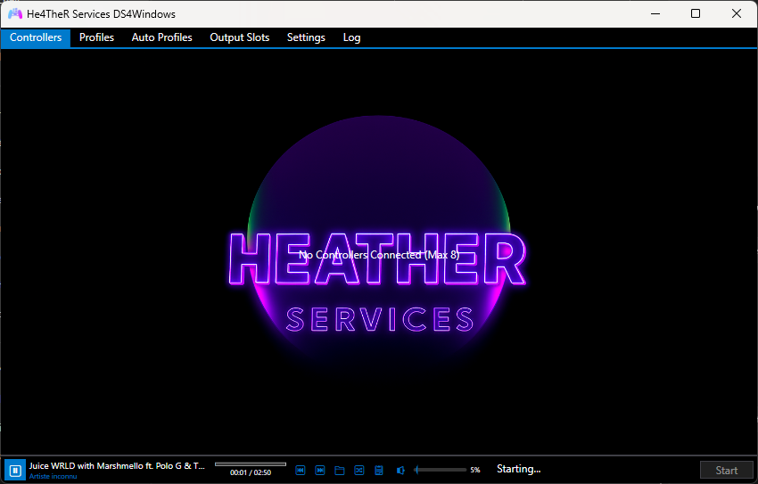

# HE4THER DS4 Windows

  

**Stack:** C# · .NET · WPF

> **Custom build** of the legendary **[DS4Windows](https://github.com/Ryochan7/DS4Windows)** — DualShock & DualSense, native on Windows.

HE4THER DS4 Windows is a **custom edition** of official DS4Windows (base **v3.3.3**).  
Same soul. Same engine. HE4THER polish on top — profiles, packaging, and branding ready for real play sessions.

This project **respects the original**: credits, license, and upstream lineage stay front and center. We don’t replace DS4Windows — we stand on its shoulders.

---

## What it is

DS4Windows maps PlayStation controllers to an Xbox 360 virtual pad (via ViGEm), so games that only speak “Xbox” just work with DualShock 4 / DualSense.

| | |
|---|---|
| **Upstream** | [Ryochan7/DS4Windows](https://github.com/Ryochan7/DS4Windows) (official, archived — final release **3.3.3**) |
| **Lineage** | Scarlet.Crush → [Jays2Kings/DS4Windows](https://github.com/Jays2Kings/DS4Windows) → Ryochan7 |
| **This repo** | HE4THER custom distribution of that stack |
| **Runtime** | .NET 8 · Windows 10/11 |
| **Launch** | `DS4Windows.exe` |

---

## Why HE4THER

- Custom **HE4THER** profile (`Profiles/@HE4THERSERVICES.xml`)
- Clean release package for quick install
- Full transparency toward the original authors and GPL terms
- Built for players who want DS4Windows — with a HE4THER identity

---

## Quick start

1. Install **[ViGEmBus](https://github.com/ViGEm/ViGEmBus/releases)** (required)
2. Install **[.NET 8 Desktop Runtime](https://dotnet.microsoft.com/download/dotnet/8.0)** if needed
3. Run `DS4Windows.exe`
4. Connect your DualShock / DualSense (USB or Bluetooth)
5. Pick the HE4THER profile (or craft your own)

---

## Respect for the original project

This is **not** a rewrite from scratch. It is a **custom version** of official DS4Windows.

- All credit for the core software goes to the DS4Windows authors and contributors  
- Official project (archived): https://github.com/Ryochan7/DS4Windows  
- Earlier fork history: https://github.com/Jays2Kings/DS4Windows  
- Copyright notices from the binary include Scarlet.Crush Productions; InhexSTER, HecticSeptic, electrobrains; Jays2Kings; **Ryochan7**

If you want the **canonical source**, issues history, and upstream releases — go to the official repo first. HE4THER is a custom distribution layered on that work.

### Upstream source

Official source & releases for v3.3.3: **[Ryochan7/DS4Windows](https://github.com/Ryochan7/DS4Windows)**  
(This repository currently ships the **application build** + HE4THER packaging/profile.)

---

## License

Licensed under the **GNU General Public License v3.0** — same family as late official DS4Windows releases.

See [LICENSE](LICENSE) and [NOTICE](NOTICE).

---

## Credits

**DS4Windows** — Scarlet.Crush, Jays2Kings, Ryochan7, and the entire community  
**ViGEm** — Nefarius & contributors  
**HE4THER edition** — [HE4THER DEV](https://github.com/He4TheR-Dev) (@He4TheR-Dev)

---

  <b>Official DS4Windows · Custom HE4THER cut</b> 
  Plug in. Play harder.

